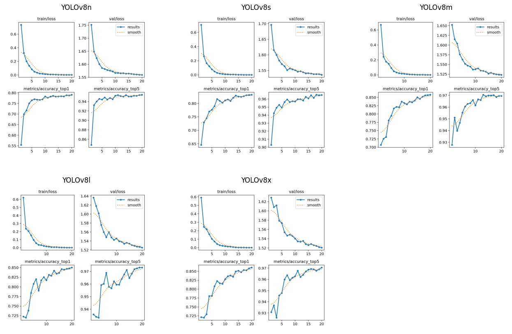
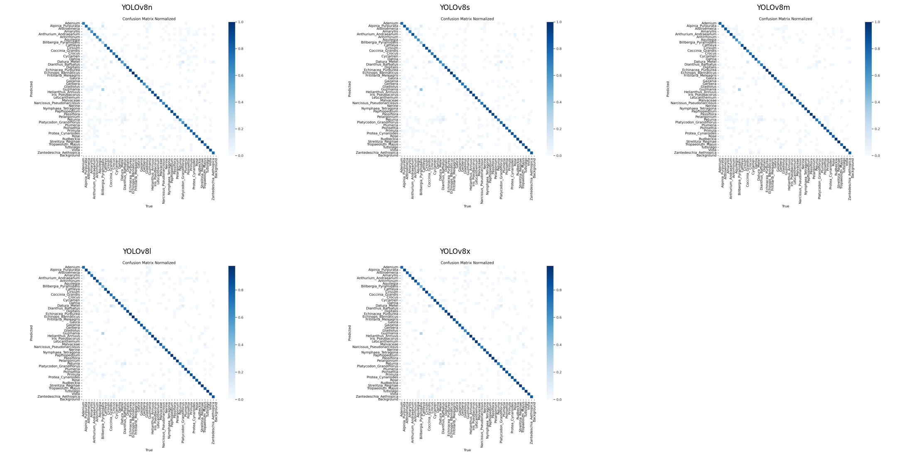
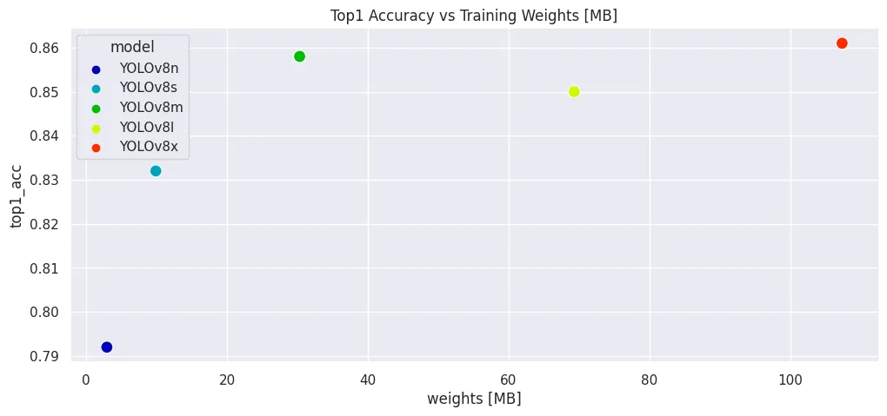
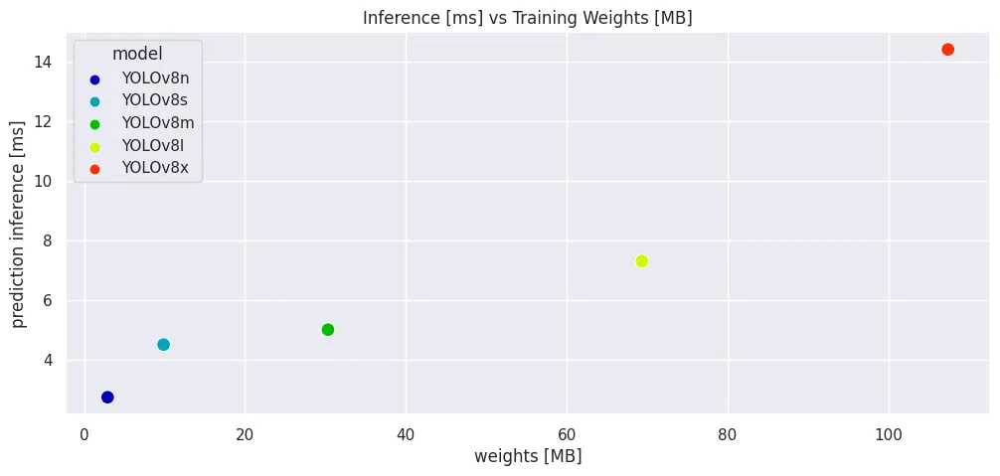

# YOLOv8 Image Classifier

Using [YOLOv8 to classifying](https://docs.ultralytics.com/tasks/classify/) an entire image into one of a set of predefined classes.

| Model | size (pixels) | acc top1 | acc top5 | Speed CPU ONNX (ms) | Speed A100 TensorRT (ms) | params (M) | FLOPs (B) at 640 |
| -- | -- | -- | -- | -- | -- | -- | -- |
| YOLOv8n-cls | 224 | 66.6 | 87.0 | 12.9 | 0.31 | 2.7 | 4.3 |
| YOLOv8s-cls | 224 | 72.3 | 91.1 | 23.4 | 0.35 | 6.4 | 13.5 |
| YOLOv8m-cls | 224 | 76.4 | 93.2 | 85.4 | 0.62 | 17.0 | 42.7 |
| YOLOv8l-cls | 224 | 78.0 | 94.1 | 163.0 | 0.87 | 37.5 | 99.7 |
| YOLOv8x-cls | 224 | 78.4 | 94.3 | 232.0 | 1.01 | 57.4 | 154.8 |


## Docker Environment

* [PyTorch Jupyter](https://github.com/mpolinowski/pytorch-jupyter)


```bash
docker run --gpus all -ti --rm \
    -v $(pwd):/opt/app -p 8888:8888 \
    --name pytorch-jupyter \
    pytorch-jupyter:latest
```


## Training Results

* [Flower Dataset (12,297 files / 48 classes)](https://github.com/mpolinowski/tf-i-know-flowers)

|         | top1_acc | top5_acc | validation [it/s] | inference [ms] | prediction preprocess [ms] | prediction inference [ms] | prediction postprocess [ms] | weights [MB] | weights (ONNX) [MB] | weights (TensorRT) [MB] |
| -- | -- | -- | -- | -- | -- | -- | -- | -- | -- | -- |
| YOLOv8n | 0.792 | 0.954 | 86.50 | 0.2 | 3.600000 | 2.733333 | 0.033333 | 2.935699 | 5.731391 | 7.929402 |
| YOLOv8s | 0.832 | 0.965 | 91.72 | 0.2 | 5.333333 | 4.500000 | 0.100000 | 9.890900 | 19.618174 | 26.030774 |
| YOLOv8m | 0.858 | 0.969 | 87.90 | 0.4 | 0.466667 | 5.000000 | 0.066667 | 30.324455 | 60.397784 | 63.700307 |
| YOLOv8l | 0.850 | 0.973 | 72.36 | 0.8 | 0.500000 | 7.300000 | 0.066667 | 69.331619 | 138.311538 | 166.345273 |
| YOLOv8x | 0.861 | 0.971 | 53.22 | 1.1 | 2.166667 | 14.400000 | 0.100000 | 107.382278 | 214.371352 | 225.140141 |














## Model Export Options

| Format | format Argument | Model | Metadata | Arguments |
| -- | -- | -- | -- | -- |
| PyTorch | - | yolov8n-cls.pt | ✅ | - |
| TorchScript | torchscript | yolov8n-cls.torchscript | ✅ | imgsz, optimize |
| ONNX | onnx | yolov8n-cls.onnx | ✅ | imgsz, half, dynamic, simplify, opset |
| OpenVINO | openvino | yolov8n-cls_openvino_model/ | ✅ | imgsz, half |
| TensorRT | engine | yolov8n-cls.engine | ✅ | imgsz, half, dynamic, simplify, workspace |
| CoreML | coreml | yolov8n-cls.mlpackage | ✅ | imgsz, half, int8, nms |
| TF SavedModel | saved_model | yolov8n-cls_saved_model/ | ✅ | imgsz, keras |
| TF GraphDef | pb | yolov8n-cls.pb | ❌ | imgsz |
| TF Lite | tflite | yolov8n-cls.tflite | ✅ | imgsz, half, int8 |
| TF Edge TPU | edgetpu | yolov8n-cls_edgetpu.tflite | ✅ | imgsz |
| TF.js | tfjs | yolov8n-cls_web_model/ | ✅ | imgsz |
| PaddlePaddle | paddle | yolov8n-cls_paddle_model/ | ✅ | imgsz |
| ncnn | ncnn | yolov8n-cls_ncnn_model/ | ✅ | imgsz, half |